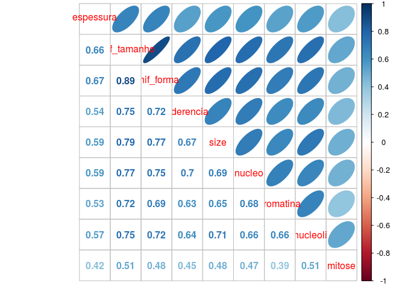
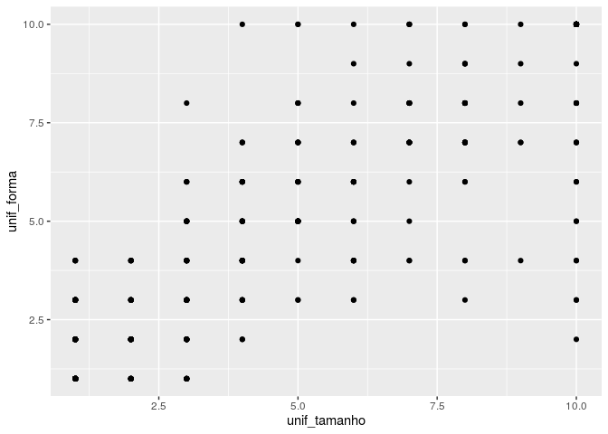
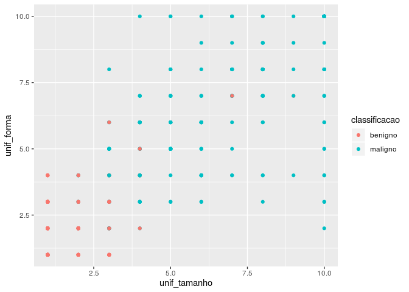
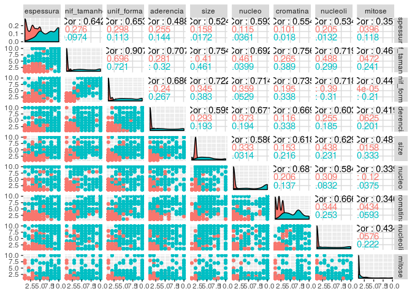
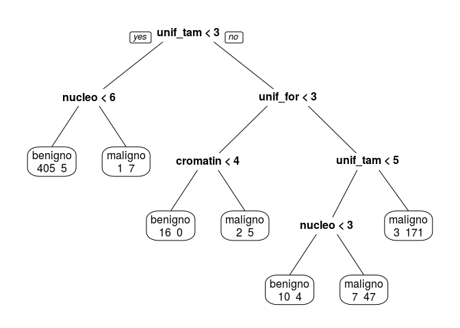
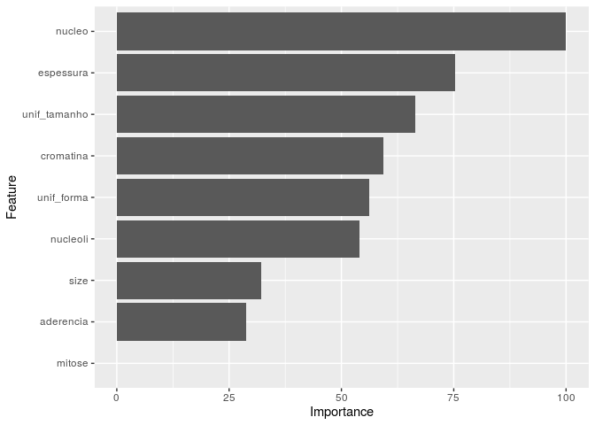

Introdução
==========

O principal objetivo deste texto é mostrar como é possível, utilizando
apenas recursos gratuitos da internet, realizar um projeto de data
science do início ao fim. Vamos treinar um algoritmo de classificação de
dados baseado em uma técnica chamada Random Forest, capaz de realizar
tanto tarefas de classificação quanto de regressão.

Há diversas atividades que podem ser feitas com este conjunto de dados.
O que farei aqui é tentar prever corretamente qual o tipo de câncer
mamário (maligno ou benigno) dado algumas observações.

O que é Nódulo na mama?
-----------------------

Nódulo de mama é definido pela presença de tumoração (ou massa palpável)
no tecido mamário, podendo ter conteúdo líquido (cístico) ou sólido. A
condição pode ser descrita como uma massa, um inchaço ou um aumento na
espessura do seio.

O tecido da mama varia de consistência, com a parte superior externa do
seio mais firme e as partes internas e inferiores um pouco mais suaves.
Os seios podem se tornar mais sensíveis ou irregulares durante a
menstruação e tendem a ficar menos densos à medida que envelhecem.

### Tipos

Os nódulos mamários podem ser divididos em sólidos ou císticos.

#### Nódulos sólidos

Os nódulos sólidos podem ser benignos ou cancerígenos. Eles são
avaliados de acordo com a forma e velocidade de crescimento. As lesões
com margens irregulares ou espiculadas são as mais suspeitas para
câncer. Já aquelas com margens regulares e crescimento lento geralmente
são benignas.

#### Nódulos císticos

Já os nódulos compostos exclusivamente por líquido sempre são benignos.
Os cistos são causados por alterações normais do tecido mamário. A única
situação preocupante neste caso é quando existe conteúdo sólido
(vegetação) dentro de um cisto.

Dados
=====

O conjunto de dados trata-se sobre o estudo de câncer, onde ele
discrimina nódulos mamários malignos e benignos. O conjunto de dados
WBCD (Wisconsin Breast Cancer Diagnosis) é amplamente utilizado para
este tipo de aplicação, porque tem um grande número de observações.

Os recursos são calculados a partir de uma imagem digitalizada de um
aspirado por agulha fina (PAAF) de uma massa mamária. Eles descrevem
características dos núcleos celulares presentes na imagem.

Variáveis do estudo:

-   Número de identificação de código da amostra.
-   Espessura do Clump (1 - 10)
-   Uniformidade do Tamanho da Célula (1 - 10).
-   Uniformidade da Forma da Célula (1 - 10)
-   Adesão Marginal (1 - 10)
-   Tamanho Único de Célula Epitelial (1 - 10)
-   Núcleos Nus (1 - 10)
-   Cromatina Branda (1 - 10)
-   Nucleoli Normal (1 - 10)
-   Mitoses (1 - 10)
-   Classe (2 para benigno, 4 para maligno)

Esse banco de dados está disponível no Repositório de Aprendizado de
Máquina da UCI:
<a href="https://archive.ics.uci.edu/ml/datasets/Breast+Cancer+Wisconsin+%28Diagnostic%29" class="uri">https://archive.ics.uci.edu/ml/datasets/Breast+Cancer+Wisconsin+%28Diagnostic%29</a>

Análise Exploratória dos Dados
==============================

Como não poderia deixar de ser, a primeira parte de um projeto de data
science segue a mesma lógica de um projeto de análise estatística de
dados. Precisamos fazer a análise exploratória a fim de entender o
conjunto de dados com o qual estamos trabalhando.

O conjunto de dados WBCD (Wisconsin Breast Cancer Diagnosis) será obtido
diretamente da internet. Então é isto que faremos abaixo, baixando este
conjunto diretamente do site do UCI Machine Learning Repository e
processando-o na sequência para análise.

``` r
# definir o endereco do conjunto de dados e baixa-lo.

url <- "https://archive.ics.uci.edu/ml/machine-learning-databases/breast-cancer-wisconsin/breast-cancer-wisconsin.data"
bc  <- read.csv(url, header=FALSE, na.strings="?")

# Nomeando cada coluna

names(bc) <- c("id", "espessura", "unif_tamanho", "unif_forma", "aderencia", "size", "nucleo", "cromatina", "nucleoli", "mitose", "classificacao")

# Removendo a coluna ID, ela não será importante para nosso objetivo.

bc <- bc[, -1]

# Mudando a codificação de números para palavras (2 para benigno, 4 para maligno)  

bc$classificacao <- ifelse(bc$classificacao==2, "benigno", "maligno")
bc$classificacao <-as.factor(bc$classificacao)
```

Feito todo o tratamento dos dados, será feito um ‘summary’ dos dados
(Estatisticas descritivas basica).

``` r
# Estatistica descritiva basica
summary(bc)
```

    ##    espessura       unif_tamanho      unif_forma       aderencia     
    ##  Min.   : 1.000   Min.   : 1.000   Min.   : 1.000   Min.   : 1.000  
    ##  1st Qu.: 2.000   1st Qu.: 1.000   1st Qu.: 1.000   1st Qu.: 1.000  
    ##  Median : 4.000   Median : 1.000   Median : 1.000   Median : 1.000  
    ##  Mean   : 4.418   Mean   : 3.134   Mean   : 3.207   Mean   : 2.807  
    ##  3rd Qu.: 6.000   3rd Qu.: 5.000   3rd Qu.: 5.000   3rd Qu.: 4.000  
    ##  Max.   :10.000   Max.   :10.000   Max.   :10.000   Max.   :10.000  
    ##                                                                     
    ##       size            nucleo         cromatina         nucleoli     
    ##  Min.   : 1.000   Min.   : 1.000   Min.   : 1.000   Min.   : 1.000  
    ##  1st Qu.: 2.000   1st Qu.: 1.000   1st Qu.: 2.000   1st Qu.: 1.000  
    ##  Median : 2.000   Median : 1.000   Median : 3.000   Median : 1.000  
    ##  Mean   : 3.216   Mean   : 3.545   Mean   : 3.438   Mean   : 2.867  
    ##  3rd Qu.: 4.000   3rd Qu.: 6.000   3rd Qu.: 5.000   3rd Qu.: 4.000  
    ##  Max.   :10.000   Max.   :10.000   Max.   :10.000   Max.   :10.000  
    ##                   NA's   :16                                        
    ##      mitose       classificacao
    ##  Min.   : 1.000   benigno:458  
    ##  1st Qu.: 1.000   maligno:241  
    ##  Median : 1.000                
    ##  Mean   : 1.589                
    ##  3rd Qu.: 1.000                
    ##  Max.   :10.000                
    ## 

Com isso, percebemos que temos um conjunto de dados formado por dez
variáveis. Nove destas variáveis são quantitativas e uma é categórica.
As variáveis são

Quantitativas:

-   espessura.
-   unif\_tamanho.
-   unif\_forma.
-   aderencia.
-   size.
-   nucleo.
-   cromatina.
-   nucleoli.
-   mitose.

Categóricas

-   classificacao.

Há diversas atividades que podem ser feitas com este conjunto de dados.
O que farei aqui é uma tarefa de classificação. Vou ajustar um modelo
que vai prever o tipo de câncer mamário (maligno ou benigno) baseado nas
variáveis quantitativas vistas anteriormente.

É importante decidir qual o objetivo do projeto logo no seu começo.
Assim, podemos direcionar nossas análises diretamente para este fim, sem
perder tempo realizando atividades que não contribuem para o objetivo.

Com o objetivo definido, vamos fazer algumas análises básicas. A
primeira delas é verificar se existe correlação entre as variáveis.
Perceba que vou retirar a coluna 10 e as observações que possuem dados
faltantes (NA’s) desta análise. (Motivo: a coluna 10 não é uma variável
quantitativa e dados faltantes podem influenciar na autocorrelação).

``` r
library(dplyr)
```

    ## 
    ## Attaching package: 'dplyr'

    ## The following objects are masked from 'package:stats':
    ## 
    ##     filter, lag

    ## The following objects are masked from 'package:base':
    ## 
    ##     intersect, setdiff, setequal, union

``` r
library(corrplot)
```

    ## corrplot 0.84 loaded

``` r
bc <- bc[-which(is.na(bc$nucleo)),]
correlacao <- cor(bc[, -10], method="spearman", use="complete.obs")
corrplot.mixed(correlacao, upper = "ellipse")
```



Podemos perceber que existem valores razoáveis de correlação entre
algumas das combinações de variáveis. Em particular, entre o comprimento
e a largura da pétala. Podemos visualizar isto em um gráfico de
dispersão:

Podemos perceber que existem valores razoáveis de correlação entre
algumas das combinações de variáveis. Em particular, entre o tamanho
único de célula epitelial e a espessura do clump. Podemos visualizar
isto em um gráfico de dispersão.

``` r
# gráfico de dispersão
library(ggplot2)
ggplot(bc, aes(x = unif_tamanho, y = unif_forma)) + geom_point()
```



Embora já vejamos a relação que existe entre as variáveis, podemos
colocar mais informações neste gráfico. Por exemplo, podemos colorir os
pontos de acordo com o tipo de câncer.

``` r
ggplot(bc, aes(x = unif_tamanho, y = unif_forma, colour = classificacao)) + geom_point()
```



Agora podemos ver que os tipos de câncer estão bastante separados. Esta
é uma informação importante, pois queremos construir um algoritmo de
classificação. Por outro lado, existe algumas observações atípicas. Isto
pode acabar prejudicando um pouco o desempenho do algoritmo de
classificação.

A fim de verificar como é o comportamento das outras variáveis, podemos
estender o gráfico anterior para todas a combinações de variáveis neste
conjunto de dados. Em vez de repetirmos manualmente o código, vamos
utilizar a função ggpairs do pacote GGally:

``` r
library(GGally)
```

    ## 
    ## Attaching package: 'GGally'

    ## The following object is masked from 'package:dplyr':
    ## 
    ##     nasa

``` r
ggpairs(bc[, -10], aes(colour = bc$classificacao))
```



Veja que agora temos muitas informações sobre os dados. Para quem já tem
alguma experiência em análise de dados, o que vemos é o seguinte:

-   Diagonal principal: estimativas da função densidade de cada
    co-variável, de acordo com o tipo de câncer

-   Triângulo inferior: gráficos de dispersão das variáveis do conjunto
    de dados, duas a duas

-   Triângulo superior: correlação total entre as variáveis e correlação
    dentro de cada grupo

Com a análise exploratória dos dados terminada, podemos partir para o
ajuste do modelo.

Ajuste do Modelo
================

Há uma infinidade de opções quando falamos de ajuste de modelos de
classificação. Neste tutorial vou utilizar o Random Forest, que é
poderoso o suficiente, além de ter convergência rápida e ser de fácil
utilização.

O Random Forest é baseado em árvores de classificação. Sem entrar muito
fundo na parte teórica, uma árvore de classificação é um modelo
matemático que utiliza a estrutura de árvore de decisão para classificar
dados. Melhor do que explicar isto em palavras é ver o algoritmo em
ação:

``` r
library(rpart)
library(rpart.plot)
modelo <- rpart(classificacao ~ ., method = "class", data = bc)
prp(modelo, extra = 1)
```



Perceba que é feita uma pergunta em cada nó da árvore. A resposta da
pergunta determina se outra pergunta será feita ou se a árvore chegou ao
fim e a classificação foi terminada. Além disso, o erro de classificação
é determinado ao final da árvore.

Uma Random Forest (ou Floresta Aleatória) é a combinação de centenas de
árvores de classificação. Este resultado segue do fato de que a
combinação de diversos modelos diferentes é melhor do que um modelo
sozinho.

Conjuntos de Treino e Teste
===========================

Um problema que surge no ajuste de modelos de classificação e regressão
é o sobreajuste. O sobreajuste ocorre quando o modelo se ajusta muito
bem aos dados, se tornando ineficaz para prever observações novas.

O gráfico abaixo ilustra este conceito no contexto de um modelo de
classificação.


Note como o modelo sobreajustado acompanha os dados muito mais de perto,
enquanto o modelo ajustado segue a tendência geral de separação dos
pontos. A desvantagem de ter um modelo que acompanhe os dados de maneira
muito próxima é a perda de generalidade. Este tipo de modelo funciona
muito bem para um conjunto de dados específico, mas vai se comportar
muito mal se novas observações forem coletadas.

Uma forma de evitar este problema é dividindo aleatoriamente o conjunto
de dados original em duas partes mutuamente exclusivas. Uma destas
partes é chamada de conjunto de treino e, a outra, conjunto de teste. A
ideia por trás disso é ajustar o modelo aos dados de treinamento e
simular a entrada de novas observações através do conjunto de teste.
Assim, é possível verificar quão bem ou quão mal o modelo ajustado está
se comportando ao prever observações que não foram utilizadas em seu
ajuste.

Para fazer isto no R utilizamos a função createDataPartition do pacote
caret.

``` r
library(caret)
```

    ## Loading required package: lattice

``` r
trainIndex <- createDataPartition(bc$classificacao, p = 0.75, list = FALSE)
cancer_treino <- bc[trainIndex, ]
cancer_teste <- bc[-trainIndex, ]
```

Esta divisão é arbitrária. Normalmente, recomenda-se que o conjunto de
treino tenha de 70% a 80% das observações. O restante das observações
irá fazer parte do conjunto de teste.

Ocorre que esta divisão dos dados em dois grupos tem uma desvantagem.
Isto acaba fazendo com que tenhamos menos dados para ajustar o modelo.
E, com menos dados para ajustar o modelo, menos informação temos. Com
menos informação, pior ficará nosso modelo. Uma maneira de reduzir este
efeito é através da validação cruzada.

Validação Cruzada
-----------------

A validação cruzada é mais um método utilizado para evitar sobreajuste
no modelo. A ideia é ajustar diversas vezes o mesmo modelo em partições
(conjuntos mutuamente exclusivos) do conjunto de treinamento original.
Neste exemplo eu vou utilizar um método chamado validação cruzada.

Esta técnica consiste em cinco passos:

1- Separar o conjunto de treinamento em *k* folds (ou partições)

2- Ajustar o modelo em *k* − 1 folds

3- Testar o modelo no fold restante

4- Repetir os passos 2 e 3 até que todos os folds tenham sido utilizados
para teste

5- Calcular a acurácia do modelo

Entretanto, precisamos definir o número de folds a serem utilizados na
validação cruzada. Em geral, a literatura sugere que de 5 a 10 folds
sejam usados. O desempenho dos algoritmos não melhora de maneira
considerável se aumentarmos muito o número de folds.

Dependendo do tamanho do conjunto de dados, é possível que muitos folds
acabem deixando-nos sem observações para os conjuntos de teste dentro da
validação cruzada. Por este motivo, é sempre bom controlar este
parâmetro de acordo com o conjunto de dados que estamos estudando.

Com estas técnicas definidas, podemos finalmente passar para o ajuste do
modelo.

Ajuste do Modelo
----------------

Como dito anteriormente, vamos ajustar um modelo chamado Random Forest
aos dados do tipo de câncer. Para realizar este ajuste precisamos criar
os conjuntos de treino e teste e fazer a validação cruzada do modelo a
ser ajustado. Como já criamos os conjuntos de treino e teste
anteriormente, apenas precisamos nos preocupar com a validação cruzada
do modelo.

Felizmente, o pacote caret já possui o algoritmo da validação cruzada
implementado. Só precisamos ser explícitos no ajuste do modelo para que
este método seja utilizado.

O caret utiliza duas funções para ajustar modelos aos dados, chamadas
train e trainControl. Basicamente, a função trainControl estabelece os
parâmetros utilizados no ajuste do modelo. Abaixo estou exemplificando
como definir que desejamos fazer validação cruzada com 5 folds.

Com os parâmetros da validação cruzada definidos, podemos partir para a
o ajuste em si.

``` r
fitControl <- trainControl(method = "cv", number = 5)

ajuste_cancer <- train(classificacao ~ ., data = cancer_treino, method = "rf", importance = TRUE, trControl = fitControl)
```

Note que defino várias coisas com a função train:

-   method = “rf” diz que vou ajustar um modelo do tipo Random Forest.
    Uma grande vantagem de usar o pacote caret é poder aprender uma
    sintaxe apenas e poder ajustar centenas de algoritmos diferentes,
    apenas mudando o argumento method da função train.

-   trControl = fitControl define as opções da validação cruzada

Para saber o resultado do ajuste, basta chamar o objeto ajuste\_cancer:

``` r
ajuste_cancer
```

    ## Random Forest 
    ## 
    ## 513 samples
    ##   9 predictor
    ##   2 classes: 'benigno', 'maligno' 
    ## 
    ## No pre-processing
    ## Resampling: Cross-Validated (5 fold) 
    ## Summary of sample sizes: 410, 411, 410, 410, 411 
    ## Resampling results across tuning parameters:
    ## 
    ##   mtry  Accuracy   Kappa    
    ##   2     0.9785266  0.9534563
    ##   5     0.9707025  0.9363065
    ##   9     0.9648391  0.9232639
    ## 
    ## Accuracy was used to select the optimal model using the largest value.
    ## The final value used for the model was mtry = 2.

Note que há um parâmetro chamado mtry no output acima. Este parâmetro
significa que os modelos foram ajustados com 2, 3, 4, … variáveis
preditoras selecionadas aleatoriamente (na verdade, quando mtry = 9
temos todas as variáveis preditoras utilizadas no modelo). Ao final, o
melhor modelo é aquele que utiliza 2 variáveis preditoras.

Este resultado pode variar dependendo de como os dados foram
selecionados durante as criação do conjunto de treinamento e teste e
também de como a validação cruzada foi realizada, principalmente se
estivermos com conjuntos de dados pequenos.

Para não alongar ainda mais, vou deixar a explicação da acurácia e do
Kappa em aberto, mas basta saber que tanto a acurácia quanto o Kappa
variam entre 0 e 1. Quanto maiores estes valores, melhor é o ajuste do
modelo.

Finalizamos o ajuste testando se este modelo criado é capaz de
classificar novos dados. Para isto, vamos utilizar o conjunto de teste
definido anteriormente:

``` r
predicao <- predict(ajuste_cancer, cancer_teste)
confusionMatrix(predicao, cancer_teste$classificacao)
```

    ## Confusion Matrix and Statistics
    ## 
    ##           Reference
    ## Prediction benigno maligno
    ##    benigno     108       0
    ##    maligno       3      59
    ##                                           
    ##                Accuracy : 0.9824          
    ##                  95% CI : (0.9493, 0.9963)
    ##     No Information Rate : 0.6529          
    ##     P-Value [Acc > NIR] : <2e-16          
    ##                                           
    ##                   Kappa : 0.9615          
    ##                                           
    ##  Mcnemar's Test P-Value : 0.2482          
    ##                                           
    ##             Sensitivity : 0.9730          
    ##             Specificity : 1.0000          
    ##          Pos Pred Value : 1.0000          
    ##          Neg Pred Value : 0.9516          
    ##              Prevalence : 0.6529          
    ##          Detection Rate : 0.6353          
    ##    Detection Prevalence : 0.6353          
    ##       Balanced Accuracy : 0.9865          
    ##                                           
    ##        'Positive' Class : benigno         
    ## 

A função confusionMatrix apresenta diversas estatísticas a respeito das
previsões que realizamos. Note que apenas duas classificações foram
feitas incorretamente. Todas as outras foram classificadas corretamente.
Além disso, a acurácia está bastante alta, igual a 0,9882. O Kappa igual
a 0,974.

Portanto, podemos concluir este projeto dizendo que fomos bem sucedidos
ao utilizar o Random Forest para classificar o tipo de câncer de acordo
com as variáveis dadas.

Para finalizar, podemos verificar quais foram, dentre as variáveis
preditoras, aquelas que tiveram a maior importância no modelo.

``` r
ggplot(varImp(ajuste_cancer))
```



Como podemos ver, as variáveis relacionadas ao núcleo e a espessura são
as mais importantes.
